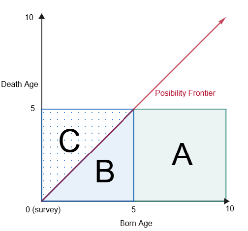

```{css, echo=FALSE}
p {
  text-align: justify !important
}
```

```{r libraries, message=FALSE, warning=FALSE, echo=FALSE}
library(tidyverse)
library(rio)
library(haven)
library(knitr)
library(DT)
library(huxtable)
library(lmtest)
library(sandwich)
library(here)
library(dplyr)
library(broom)
library(gridExtra)
library(ggridges)
library(ggplot2)
```

```{r import_data, message=FALSE, warning=FALSE, echo=FALSE}
# Load data civ88-08_nutri.dta and civ88-08_mortality.dta
civ_nutri <- read_dta(here::here("measurement_p2/data/civ88-08_nutri.dta"))
civ_mortality <- read_dta(here::here("measurement_p2/data/civ88_mort.dta"))
# save as csv
# write_csv(civ_nutri, "measurement_p2/data/civ88-08_nutri.csv")
# write_csv(civ_mortality, "measurement_p2/data/civ88-08_mortality.csv")
```

# 1 Child Mortality in Côte d'Ivoire (6 points)

## 1. Sampling (1 points)

**(a) How should you transform pweight to obtain a weight that allows you to estimate statistics on the population of women in Cote d'Ivoire? Explain your computations.**

I can use the pweight column to balance the class distribution of the sample to match the population distribution. The `pweight` column contains sample weights that modify the contribution of each observation to the overall statistics. It works as a frequency multiplier, where each observation is counted as if it were `pweight` number of observations. In practice, R can use the pweight column to compute weighted statistics, such as means and proportions by using the `weights` argument in functions like `lm()` or `survey::svydesign()`. Internally, weighted functions such as weighted means and lm will multiply each observation by its corresponding weight. For example a weighted mean will be computed using equation @eq-weighted_mean, and weighted linear regression will minimize the weighted sum of squared residuals, as shown in equation @eq-weighted_lm.

$$
\bar{x}_w = \frac{\sum_{i=1}^{n} w_i x_i}{\sum_{i=1}^{n} w_i}
$$ {#eq-weighted_mean}

$$
\sum_{i=1}^{n} w_i (y_i - \hat{y}_i)^2
$$ {#eq-weighted_lm}

## 2. Measurement of under 5 mortality rate (5 points)

**(a) What method can be deemed preferable and why? Give the pros and cons of both methods.**

The preferable method is method 2 (M2) because method 1 (M1) underestimates the mortality rate by not capturing the deaths that occur after the survey period. @fig-mortality shows graphycally the surveyed groups: the x-axis represents the age of the child at the time of the survey, and the y-axis represents the age of the child at the time of death. The red arrow at 45 degrees indicates the frontier of possible outcomes, since by definition noone can die after their current age, the survey caputures outcomes below the frontier. Notice M1 captures area B and drops area C underestimating the true mortality rate. M2 captures area C which represents the true mortality rate. For example a surveyed mother has a child one year before the survey and the child dies the year after the survey (area C in @fig-mortality), M1 will not capture his death because by definition nothing can die after its current age.

M1

- Pros: it is easy to compute, captures the most recent deaths (recency).
- Cons: underestimates the mortality rate, downward biased, does not capture deaths after the survey period.

M2

- Pros: provides a robust estimate of the true mortality rate.
- Cons: it requires a longer period of time to capture deaths, less recent than M1.

{#fig-mortality width="50%"}

**(b) Child mortality rates in Côte d'Ivoire.**

**i. Compute mortality rates with both methods for boys and girls separately (don't forget the weights).**

```{r, echo=FALSE, message=FALSE, warning=FALSE}
# Method 1
# Boys
model_1_boys <- lm(
  (dboys_l5) / (boys_l5) ~ 1, 
  data = civ_mortality %>% filter(boys_l5 > 0), 
  weights = pweight * boys_l5
)

# Girls
model_1_girls <- lm(
  (dgirls_l5) / (girls_l5) ~ 1, 
  data = civ_mortality %>% filter(girls_l5 > 0), 
  weights = pweight * girls_l5
)

# Method 2
# Boys
model_2_boys <- lm(
  (dboys_u5 - dboys_l5) / (boys - boys_l5) ~ 1, 
  data = civ_mortality %>% filter((boys - boys_l5) > 0), 
  weights = pweight * (boys - boys_l5)
)

# Girls
model_2_girls <- lm(
  (dgirls_u5 - dgirls_l5) / (girls - girls_l5) ~ 1, 
  data = civ_mortality %>% filter((girls - girls_l5) > 0), 
  weights = pweight * (girls - girls_l5)
)

# 1. Create Pooled Data for Boys
boys_pooled <- bind_rows(
  civ_mortality %>% 
    filter(boys_l5 > 0) %>% 
    transmute(rate = dboys_l5 / boys_l5, w = pweight * boys_l5, is_m2 = 0),
  civ_mortality %>% 
    filter((boys - boys_l5) > 0) %>% 
    transmute(rate = (dboys_u5 - dboys_l5) / (boys - boys_l5), w = pweight * (boys - boys_l5), is_m2 = 1)
)

# 2. Create Pooled Data for Girls
girls_pooled <- bind_rows(
  civ_mortality %>% 
    filter(girls_l5 > 0) %>% 
    transmute(rate = dgirls_l5 / girls_l5, w = pweight * girls_l5, is_m2 = 0),
  civ_mortality %>% 
    filter((girls - girls_l5) > 0) %>% 
    transmute(rate = (dgirls_u5 - dgirls_l5) / (girls - girls_l5), w = pweight * (girls - girls_l5), is_m2 = 1)
)

# 3. Run the Difference Regressions
diff_boys <- lm(rate ~ is_m2, data = boys_pooled, weights = w)
diff_girls <- lm(rate ~ is_m2, data = girls_pooled, weights = w)

# 4. Extract the coefficient matrices
ct_boys <- coeftest(diff_boys)
ct_girls <- coeftest(diff_girls)

# 5. Isolate ONLY the 2nd row (the difference), and restore the 'coeftest' class
# so that broom/huxtable knows how to read it without throwing a matrix error.
ct_diff_boys <- ct_boys[2, , drop = FALSE]
class(ct_diff_boys) <- "coeftest"
rownames(ct_diff_boys) <- "(Intercept)"  # Disguise it for alignment

ct_diff_girls <- ct_girls[2, , drop = FALSE]
class(ct_diff_girls) <- "coeftest"
rownames(ct_diff_girls) <- "(Intercept)"

# 1. Create Pooled Data for Sex Comparison (Method 2 Only)
m2_sex_pooled <- bind_rows(
  # Boys Method 2 (Indicator = 0)
  civ_mortality %>% 
    filter((boys - boys_l5) > 0) %>% 
    transmute(rate = (dboys_u5 - dboys_l5) / (boys - boys_l5), w = pweight * (boys - boys_l5), is_girl = 0),
  # Girls Method 2 (Indicator = 1)
  civ_mortality %>% 
    filter((girls - girls_l5) > 0) %>% 
    transmute(rate = (dgirls_u5 - dgirls_l5) / (girls - girls_l5), w = pweight * (girls - girls_l5), is_girl = 1)
)

# 2. Run the Difference Regression (Girls M2 - Boys M2)
diff_sex_m2 <- lm(rate ~ is_girl, data = m2_sex_pooled, weights = w)

# 3. Isolate the gender difference coefficient and disguise it for huxreg alignment
ct_diff_sex_m2 <- coeftest(diff_sex_m2)[2, , drop = FALSE]
class(ct_diff_sex_m2) <- "coeftest"
rownames(ct_diff_sex_m2) <- "(Intercept)"

# 6. Generate the single-row 6-Column Table
outreg <- huxreg(
  `M1 (Boys)` = model_1_boys,
  `M2 (Boys)` = model_2_boys,
  `Diff (Boys)` = ct_diff_boys,
  `M1 (Girls)` = model_1_girls,
  `M2 (Girls)` = model_2_girls,
  `Diff (Girls)` = ct_diff_girls,
  `Diff M2 G-B` = ct_diff_sex_m2, # New column added here
  coefs = c("Mortality rate" = "(Intercept)"),
  error_format = "({std.error})",
  error_pos = "below",
  align = "c",
  statistics = c(N = "nobs", R2 = "r.squared"),
  stars = c(`***` = 0.01, `**` = 0.05, `*` = 0.1),
  note = "Significance: {stars}"
)

outreg <- set_label(outreg, "tbl-child_mortality")
outreg <- set_caption(outreg, "Child mortality rates in Côte d'Ivoire, by sex and method.")
outreg <- set_all_padding(outreg, 1.5)
outreg
```

**ii. Compare and comment.**

Table \ref{tbl-child_mortality} shows the estimated child mortality rates in Côte d'Ivoire for boys and girls using both methods and their differences. The results confirm our theory of M1 underestimating the true mortality rate. We can clearly see the method estimates differences are positive indicating that M1 systematically underestimates the true mortality rate estimated by M2. Using the best method (M2), the average mortality rate for boys is 13.5% and for girls is 11.9%. The difference between girls and boys is -2 percentage points and statitically significant at the 90% confidence level, indicating that boys have a higher mortality rate than girls.

# 2 Health status, nutritional status and wealth in Côte d'Ivoire (7 points)

*Stunted children are defined as children showing a height stature that is lower than the median of the reference population by 2 standard deviations measured on the same reference population. That is children such as the z-score is lower than -2 (*$z \le -2$), where the z-score is given by the following formula:

$$Z = \frac{\text{height} - \text{WHOMedian}(\text{sex}, \text{age})}{\text{WHOstdev}(\text{sex}, \text{age})}$$

## 1. Weight Unit Correction

*In 2008, the weight could be measured in either kilograms or hectograms. However, the unit was not systematically reported. It was therefore assumed that all the weights were reported in kilograms.*

**(a) Derive an expression for the sample mean weight in this context, and show that, if we knew just one parameter, we could obtain a non-biased estimate of the mean weight despite the hectogram issue. (.5 point)**

Let's denote the estimated mean weight as $W_{\text{obs}}$, the true mean weight as $W_{\text{true}}$, and the proportion of weights measured in hectograms as $p_h$. The observed mean weight can be expressed as the sum of the mean weights measured in kg and in hectograms multiplied by their corresponding probabilities:

$$
\begin{aligned}
E[W_{\text{obs}}] &= (1 - p_h) \cdot W_{\text{true}} + p_h \cdot W_{\text{true}}\cdot 10\\
  &= W_{\text{true}} \cdot (1 - p_h + 10 p_h)\\
  &= W_{\text{true}} \cdot (1 + 9 p_h)
\end{aligned}
$$

Thus, having an estimate of $p_h$ would allow us to correct the observed mean weight. Notice that if $p_h = 0$, then $E[W_{\text{obs}}] = W_{\text{true}}$, and if $p_h = 1$, then $E[W_{\text{obs}}] = 10 W_{\text{true}}$. 

**(b) Come up with an empirical criterion to identify hectogram mistakes, and a graphical way to show the 2008 weight distribution, before and after correcting for mistakes, compared with the 1988 and 1993 weight distributions. (1 point)**

By looking at the original distribution the weight measurements in 2008 show a wider distribution than the 1988 and 1993 distributions. The 2008 distribution shows a principal component at around 12kg but also shows multiple peaks at weight > 25kg while the 1988 and 1993 distributions show a principal component at around 12kg with minimal outliers e.g. a few values below 1kg. See Figure \ref{fig-distributions} LHS.

After updating the 2008 weight distribution by dividing all weights > 25kg by 10, the distribution shows no peaks after 25kg. See Figure \ref{fig-distributions} RHS.

```{r fixing_distributions, echo=FALSE, message=FALSE, warning=FALSE}
#| label: fig-distributions
#| fig-cap: "Distribution of Weight (kg) Before and After Correction"

plot_1 <-ggplot(civ_nutri, aes(weightkg, fill = factor(year), colour = factor(year))) + ylab("Kernel Density") + xlab("Weight (kg)") + ggtitle("Before Correction") +
  geom_density(alpha = 0.3) +
  labs(fill = "Year", colour = "Year")+
  xlim(0, 100) + ylim(0, NA) + theme_minimal() +
  theme(plot.title = element_text(hjust = 0.5), plot.subtitle = element_text(hjust = 0.5), legend.position = "inside", legend.position.inside = c(0.8, 0.8))

# update original data
civ_nutri <- civ_nutri %>% mutate(weightkg_corrected = ifelse(year == 2008 & weightkg > 25, weightkg / 10, weightkg))

plot_2 <-ggplot(civ_nutri, aes(weightkg_corrected, fill = factor(year), colour = factor(year))) + ylab("Kernel Density") + xlab("Weight (kg)") + ggtitle("After Correction") +
  geom_density(alpha = 0.3) +
  labs(fill = "Year", colour = "Year")+
  xlim(0, 100) + ylim(0, NA) + theme_minimal() +
  theme(plot.title = element_text(hjust = 0.5), plot.subtitle = element_text(hjust = 0.5), legend.position = "inside", legend.position.inside = c(0.8, 0.8))

grid.arrange(plot_1, plot_2, ncol=2)
```

## 2. Z-Score Computation
**Using the variables medheight and stdheight, compute each child's z-score. (.5 point)**
Estimated z-scores are computed using the mentioned formula. The resulting distribution of z-scores for 2-4 years old children by year and region is shown in Figure \ref{fig-distributions_stunted}

```{r, echo=FALSE, message=FALSE, warning=FALSE}
civ_nutri <- civ_nutri %>% mutate(z_score = (height - medheight) / stdheight) %>% mutate(stunted = ifelse(z_score < -2, 1, 0))
civ_2_4years <- civ_nutri %>% filter(age >= 2*12 & age < 4*12)
```

## 3. Height Stature over time and across regions (3 points)

**(a) Estimate the stunting rate for 2-4 years old children over time in the North, in the South, and at the national level. Decide what are outliers, and show results both including and excluding outliers. Comment your results, making all relevant comparisons.**

```{r overtime_a_w_outliers, echo=FALSE, message=FALSE, warning=FALSE}
model_stunted_national <- lm(stunted ~ factor(year)-1, data = civ_2_4years, weights = pweight)
model_stunted_north <- lm(stunted ~ factor(year)-1, data = civ_2_4years %>% filter(north == 1), weights = pweight)
model_stunted_south <- lm(stunted ~ factor(year)-1, data = civ_2_4years %>% filter(north == 0), weights = pweight)

# 1. Run the interacted model to get the differences by year
model_diff_ns <- lm(
  stunted ~ factor(year) + factor(year):north - 1, 
  data = civ_2_4years, 
  weights = pweight
)

# 2. Extract the coefficient matrix
ct_diff_ns <- coeftest(model_diff_ns)

# 3. Isolate ONLY the interaction rows (the North-South differences)
# These will be the coefficients named "factor(year)1988:north", etc.
diff_rows <- grep(":north", rownames(ct_diff_ns))
ct_diff_only <- ct_diff_ns[diff_rows, , drop = FALSE]

# 4. Disguise the row names so huxtable aligns them with the other models
rownames(ct_diff_only) <- c("factor(year)1988", "factor(year)1993", "factor(year)2008")

# 5. Restore the coeftest class
class(ct_diff_only) <- "coeftest"

# put everything in a huxtable
outreg_stunted_w_outliers <- huxreg(
  `National` = model_stunted_national,
  `North` = model_stunted_north,
  `South` = model_stunted_south,
  `Diff (North-South)` = ct_diff_only,
  coefs = c(
    "Year 1988" = "factor(year)1988",
    "Year 1993" = "factor(year)1993",
    "Year 2008" = "factor(year)2008"
  ),
  error_format = "({std.error})",
  error_pos = "below",
  align = "c",
  statistics = c(
    N = "nobs",
    R2 = "r.squared"
  ),
  stars = c(`***` = 0.01, `**` = 0.05, `*` = 0.1),
  note = "Significance: {stars}"
)

outreg_stunted_w_outliers <- set_all_padding(outreg_stunted_w_outliers, 1.5)
outreg_stunted_w_outliers <- set_label(outreg_stunted_w_outliers, "tbl-stunted_w_outliers")
outreg_stunted_w_outliers <- set_caption(outreg_stunted_w_outliers, "National, North, and South stunting rates for 2-4 years old children including outliers.")
outreg_stunted_w_outliers
```

```{r, overtime_a_n_outliers, echo=FALSE, message=FALSE, warning=FALSE}
# Remove outliers (z-score < -6 or z-score > 6)
civ_2_4years_no_outliers <- civ_2_4years %>% filter(z_score >= -6 & z_score <= 6)

# Re-estimate the models without outliers
model_stunted_national_no_outliers <- lm(stunted ~ factor(year)-1, data = civ_2_4years_no_outliers, weights = pweight)
model_stunted_north_no_outliers <- lm(stunted ~ factor(year)-1, data = civ_2_4years_no_outliers %>% filter(north == 1), weights = pweight)
model_stunted_south_no_outliers <- lm(stunted ~ factor(year)-1, data = civ_2_4years_no_outliers %>% filter(north == 0), weights = pweight)

model_diff_ns_no_outliers <- lm(
  stunted ~ factor(year) + factor(year):north, 
  data = civ_2_4years_no_outliers, 
  weights = pweight
)

# 2. Extract the coefficient matrix
ct_diff_ns <- coeftest(model_diff_ns_no_outliers)

# 3. Isolate ONLY the interaction rows (the North-South differences)
# These will be the coefficients named "factor(year)1988:north", etc.
diff_rows <- grep(":north", rownames(ct_diff_ns))
ct_diff_only <- ct_diff_ns[diff_rows, , drop = FALSE]

# 4. Disguise the row names so huxtable aligns them with the other models
rownames(ct_diff_only) <- c("factor(year)1988", "factor(year)1993", "factor(year)2008")

# 5. Restore the coeftest class
class(ct_diff_only) <- "coeftest"

# put everything in a huxtable
outreg_stunted_n_outliers <- huxreg(
  `National` = model_stunted_national_no_outliers,
  `North` = model_stunted_north_no_outliers,
  `South` = model_stunted_south_no_outliers,
  `Diff (North-South)` = ct_diff_only,
  coefs = c(
    "Year 1988" = "factor(year)1988",
    "Year 1993" = "factor(year)1993",
    "Year 2008" = "factor(year)2008"
  ),
  error_format = "({std.error})",
  error_pos = "below",
  align = "c",
  statistics = c(
    N = "nobs",
    R2 = "r.squared"
  ),
  stars = c(`***` = 0.01, `**` = 0.05, `*` = 0.1),
  note = "Significance: {stars}"
)

outreg_stunted_n_outliers <- set_label(outreg_stunted_n_outliers, "tbl-stunted_n_outliers")
outreg_stunted_n_outliers <- set_caption(outreg_stunted_n_outliers, "National, North, and South stunting rates for 2-4 years old children excluding outliers.")
outreg_stunted_n_outliers <- set_all_padding(outreg_stunted_n_outliers, 1.5)
outreg_stunted_n_outliers
```

<!-- ```{r, echo=FALSE, message=FALSE, warning=FALSE}
#| label: fig-distributions_stunted
#| fig-cap: "Distribution of z-scores for 2-4 years old children by year and region"
#| fig-subcap: "X-axis is limited to -6 to 6, and the dashed line indicates the stunting threshold of -2."

ggplot(civ_2_4years, aes(x = z_score, y = factor(year), fill = factor(north))) +
  geom_density_ridges(alpha=0.3) +
  geom_vline(xintercept = -2, linetype = "dashed") +
  scale_fill_discrete(labels = c("South", "North")) +
  theme_ridges() + 
  labs(fill = NULL) +
  theme(legend.position = c(0.98, 0.98), legend.justification = c(1, 1)) + xlim(-6, 6) + xlab("Z-Score") + ylab("Year") + ggtitle("Z-Scores for 2-4 Years Old Children by Year")
``` -->

```{r, echo=FALSE, message=FALSE, warning=FALSE}
#| label: fig-distributions_stunted
#| fig-cap: "Distribution of z-scores for 2-4 years old children by year and region"
#| fig-subcap: "X-axis is limited to -6 to 6, and the dashed line indicates the stunting threshold of -2."

ggplot(civ_2_4years, aes(x = z_score, y = factor(year), fill = factor(sexe))) +
  geom_density_ridges(alpha=0.3) +
  geom_vline(xintercept = -2, linetype = "dashed") +
  scale_fill_discrete(labels = c("Female", "Male")) +
  theme_ridges() + 
  labs(fill = NULL) +
  theme(legend.position = c(0.98, 0.98), legend.justification = c(1, 1)) + xlim(-6, 6) + xlab("Z-Score") + ylab("Year") + ggtitle("Z-Scores for 2-4 Years Old Children by Year")
```
**(b) Estimate the stunting rate for 2-4 years old children over time for boys and for girls at the national level. Decide what are outliers, and show results both including and excluding outliers. Comment your results, making all relevant comparisons.**

```{r overtime_s_w_outliers, echo=FALSE, message=FALSE, warning=FALSE}
model_stunted_sexe_1 <- lm(stunted ~ factor(year)-1, data = civ_2_4years %>% filter(sexe == 1), weights = pweight)
model_stunted_sexe_0 <- lm(stunted ~ factor(year)-1, data = civ_2_4years %>% filter(sexe == 0), weights = pweight)

# 1. Run the interacted model to get the differences by year
model_diff_ns <- lm(stunted ~ factor(year) + factor(year):sexe - 1, data = civ_2_4years, weights = pweight)

# 2. Extract the coefficient matrix
ct_diff_ns <- coeftest(model_diff_ns)

diff_rows <- grep(":sexe", rownames(ct_diff_ns))
ct_diff_only <- ct_diff_ns[diff_rows, , drop = FALSE]

# 4. Disguise the row names so huxtable aligns them with the other models
rownames(ct_diff_only) <- c("factor(year)1988", "factor(year)1993", "factor(year)2008")

# 5. Restore the coeftest class
class(ct_diff_only) <- "coeftest"

outreg_stunted_w_outliers_sex <- huxreg(
  `Male` = model_stunted_sexe_1,
  `Female` = model_stunted_sexe_0,
  `Diff (Male-Female)` = ct_diff_only,
  coefs = c(
    "Year 1988" = "factor(year)1988",
    "Year 1993" = "factor(year)1993",
    "Year 2008" = "factor(year)2008"
  ),
  error_format = "({std.error})",
  error_pos = "below",
  align = "c",
  statistics = c(
    N = "nobs",
    R2 = "r.squared"
  ),
  stars = c(`***` = 0.01, `**` = 0.05, `*` = 0.1),
  note = "Significance: {stars}"
)

outreg_stunted_w_outliers_sex <- set_all_padding(outreg_stunted_w_outliers_sex, 1.5)
outreg_stunted_w_outliers_sex <- set_label(outreg_stunted_w_outliers_sex, "tbl-stunted_w_sex_outliers")
outreg_stunted_w_outliers_sex <- set_caption(outreg_stunted_w_outliers_sex, "National stunting rates for 2-4 years old boys and girls including outliers.")
outreg_stunted_w_outliers_sex
```

```{r overtime_s_n_outliers, echo=FALSE, message=FALSE, warning=FALSE}
model_stunted_sexe_1 <- lm(stunted ~ factor(year)-1, data = civ_2_4years_no_outliers %>% filter(sexe == 1), weights = pweight)
model_stunted_sexe_0 <- lm(stunted ~ factor(year)-1, data = civ_2_4years_no_outliers %>% filter(sexe == 0), weights = pweight)

# 1. Run the interacted model to get the differences by year
model_diff_ns <- lm(stunted ~ factor(year) + factor(year):sexe - 1, data = civ_2_4years_no_outliers, weights = pweight)

# 2. Extract the coefficient matrix
ct_diff_ns <- coeftest(model_diff_ns)

diff_rows <- grep(":sexe", rownames(ct_diff_ns))
ct_diff_only <- ct_diff_ns[diff_rows, , drop = FALSE]

# 4. Disguise the row names so huxtable aligns them with the other models
rownames(ct_diff_only) <- c("factor(year)1988", "factor(year)1993", "factor(year)2008")

# 5. Restore the coeftest class
class(ct_diff_only) <- "coeftest"

outreg_stunted_n_outliers_sex <- huxreg(
  `Male` = model_stunted_sexe_1,
  `Female` = model_stunted_sexe_0,
  `Diff (Male-Female)` = ct_diff_only,
  coefs = c(
    "Year 1988" = "factor(year)1988",
    "Year 1993" = "factor(year)1993",
    "Year 2008" = "factor(year)2008"
  ),
  error_format = "({std.error})",
  error_pos = "below",
  align = "c",
  statistics = c(
    N = "nobs",
    R2 = "r.squared"
  ),
  stars = c(`***` = 0.01, `**` = 0.05, `*` = 0.1),
  note = "Significance: {stars}"
)
outreg_stunted_n_outliers_sex <- set_all_padding(outreg_stunted_n_outliers_sex, 1.5)
outreg_stunted_n_outliers_sex <- set_label(outreg_stunted_n_outliers_sex, "tbl-stunted_n_sex_outliers")
outreg_stunted_n_outliers_sex <- set_caption(outreg_stunted_n_outliers_sex, "National stunting rates for 2-4 years old boys and girls excluding outliers.")
outreg_stunted_n_outliers_sex
```

## 4. Height Stature and poverty (2 points)

**Here, one would like to study how the gradient of the number of stunted children aged 2-4 years, and of household consumption per capita, as well as the relationship between the two, have changed over time.** **Find a graphical or regression framework to represent this (many options are possible). Comment on your results and their limits.**

\[Your answer here\]

# 3 A meaningful table (6 pts)

**Construct a small statistical table showing a meaningful and policy relevant social fact about migration in the world. You may focus, or not, on a given region or country of origin, or on a particular subgroup of the population (children, etc.) A combination of originality, policy relevance and statistical accuracy will be very much appreciated. The table should fit in the top half of a page. It should have the attributes of a proper research-paper table: title, notes, etc. Table notes should indicate the source of data, the coverage (countries and population), the definition and units of variables and any other kind of information that is needed to read and understand the table. The bottom half of the page should be dedicated to a brief text, commenting upon the social fact that the table reveals.**\[cite: 31\]

\[Your table and text here\]

# Appendix: R Script

*Please do not show your R script before every question, but put your entire R script at the end of the homework.*